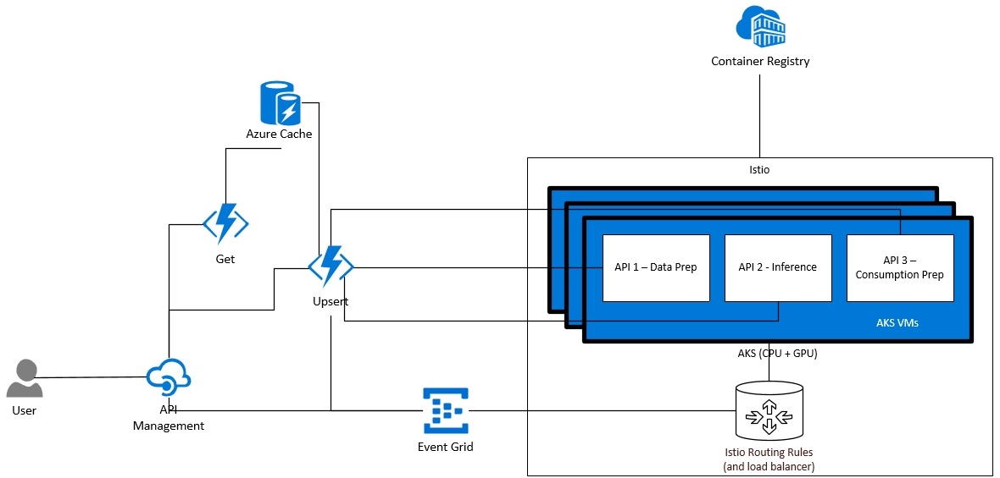
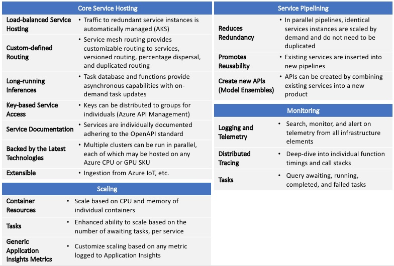

## Due to new featues that have since been added to Azure Machine Learning, this repository is now deprecated.

# AI for Earth Engineering and Data Science
After developing an algorithm or machine learning model, researchers face the problem of deploying their model for others to consume, integrating it with data sources, securing its access, and keeping it current.  Due to these complexities, the vast majority of this work is  confined to the researcher’s private device, limiting the model’s application. Microsoft's AI for Earth team has built tools to democratize a researcher’s product through the use of containerized APIs that allow scientists to “drop in” their models and deploy to the cloud for world-wide consumption.  Further, AI for Earth’s API Platform is a portable, distributed serving system that provides a scalable and extensible way to integrate the model with Azure resources, which unlocks composition of discrete APIs via pipelining.

## Contents
1. [AI for Earth API Framework](#AI-for-Earth-API-Framework) - Build images required to fully take advantage of the platform's capabilities.
2. [AI for Earth API Platform](#AI-for-Earth-API-Platform) - Overview and features.
3. [Platform Elements and Costs](#Platform-Elements-and-Costs)
4. [Platform Deployment](#Platform-Deployment)
5. [API Deployment](#API-Deployment)
6. [Platform Alternatives](#Alternatives)
7. [Contributions](#Contributing)

## AI for Earth API Framework
The [AI for Earth API Framework](https://github.com/microsoft/AIforEarth-API-Development) is used to create container images to be used with this infrastructure.  The API Framework is a complete, in-depth resource for turning a model or generic algorithm into an API for use in Azure.

Several AI for Earth container images exist, featuring Python and R, and contain:
- Libraries for API hosting
- Azure Blob SDK (SAS and AAD)
- Monitoring and distributed tracing
- AI4E task manager for long-running ML inference
- AI4E API service library – decorate existing functions to turn into APIs

## AI for Earth API Platform
The API Platform, comprised of a number of Azure components, provides a long-running, scalable, secure, and extensible hosting environment for model inference.  The core system is backed by Istio-routed Kubernetes clusters.  Azure API Management is used as a gateway and provides security, documentation, product grouping, and custom processing.  Azure Functions provide the light, on-demand compute needed to interact with the task database (Azure Redis) and to push requests to an eventing framework (Azure Event Grid).  All telemetry and logging is sent to Application Insights and is used for monitoring and alerting.

The API Platform has been built to directly accept any containers built with the API Framework.  Production-ready versions of the framework images replace the default task library with a distributed task library and publishes the container into the production platform.

### Pipelining
When used in conjunction with the API Framework, the API Platform is capable of creating pipelines of APIs.  This provides ensemble capabilities, which can produce new, composite API pipelines, which are exposed as new APIs.  Using this method, one can drastically lower the cost of running dozens of concurrent pipelines.  Due to the nature of Kubernetes and the pipelining capability, instances of redundant services can be minimized and scaled only when they are needed.

### High-level Architecture

### Feature Overview

## Platform Elements and Costs
The AI for Earth Platform is constructed using a number of Azure services.  Using such a microservice architecture lets one take advantage of the Azure service SLAs.  This is opposed to implementing custom larger services that must be maintained in a larger extent than the building block approach.  In this section, we list the Azure services that are used, why we use them, their SLA (at the time of writing), and the costs (at the time of writing) associated with each service.

### [AKS](https://azure.microsoft.com/en-us/services/kubernetes-service/) - Fully Manged Kubernetes
#### Use
Orchestration engine that manages your API services.  AKS handles load balancing, container and VM scaling, etc.  This service is required.

#### [SLA](https://azure.microsoft.com/en-us/support/legal/sla/kubernetes-service/v1_1/)
As a free service, AKS does not offer a financially-backed service level agreement.  In practice, however, AKS strives for 99.95% availability.  Agent nodes are covered by the [VM SLA](https://azure.microsoft.com/en-us/support/legal/sla/virtual-machines/v1_9/), which is 99.9% - 99.99%.

#### Costs
Azure Kubernetes Service (AKS) is a [free container service](https://azure.microsoft.com/en-us/pricing/details/kubernetes-service/).

### [Virtual Machines](https://azure.microsoft.com/en-us/free/virtual-machines)
#### Use
Virtual Machines (VM) are used as the nodes within your AKS cluster.  VMs are required.

#### Costs
Azure provides several [VM SKUs](https://azure.microsoft.com/en-us/pricing/details/virtual-machines/linux/), as such, costs differ widely.  The default VMs that are set in the [setup_env.sh](./InfrastructureDeployment/setup.env.sh) are the Standard_DS2_v2 CPU SKU ($0.114/hour) and the Standard_NC6s_v3 ($0.90/hour) GPU SKU.  The quoted prices are pay-as-you go.  Significant savings can be achieved by reserving VMs and using Spot VMs.

#### [SLA](https://azure.microsoft.com/en-us/support/legal/sla/virtual-machines/v1_9/)
99.9% - 99.99%.

### [Azure Container Registry (ACR)](https://docs.microsoft.com/en-us/azure/container-registry/container-registry-intro)
#### Use
ACR is used to house your API images.  AKS downloads images from ACR and creates containers from them, managed by AKS.  This service is required.

#### [SLA](https://azure.microsoft.com/en-us/support/legal/sla/container-registry/v1_1/)
99.9%

#### Costs
Azure Container Registry starts at [$0.167](https://azure.microsoft.com/en-us/pricing/details/container-registry/) per day.

### [Event Grid](https://azure.microsoft.com/en-us/services/event-grid/)
#### Use
Event Grid is used as the routing service that sends asynchronous requests to AKS.  This is required when using the platform's task feature, otherwise it is optional.

#### [SLA](https://azure.microsoft.com/en-in/support/legal/sla/event-grid/v1_0/)
99.99%

#### Costs
The Event Grid service is [free](https://azure.microsoft.com/en-us/pricing/details/event-grid/), up to 100,000 operations per month.  After that, 1 million operations cost [$0.60](https://azure.microsoft.com/en-us/pricing/details/event-grid/) per month.

### [Azure Function Plan](https://docs.microsoft.com/en-us/azure/azure-functions/functions-scale) and Azure Functions

#### Use
Azure Functions are used to house all of the custom processing code in the platform.  This is required, but some of the features are optional.  The features that use Azure Functions are:
- Cache Manager - processes asynchronous request tasks.
- Task Process Logger - logs all task statuses in Application Insights.  This is used by the Application Insights custom metrics adapter to scale API services based on awaiting and completed tasks.
- Request Reporter - logs the imcoming requests and completed requests within a particular instance of an API service.  This can also be used to scale via the Application Insights custom metrics adapter.
- Backend Webhook - creates a webhook used by the Event Grid instance to allow integration with an AKS HTTP endpoint.  HTTPS should be used for production deployments.

#### [SLA](https://azure.microsoft.com/en-us/support/legal/sla/functions/v1_1/)
99.95%

#### Costs
Azure Function [costs](https://azure.microsoft.com/en-us/pricing/details/functions/) are based on execution time ($0.000016/GB-s) and total number of excutions ($0.20 per million) per month.

The default plan that is set in the [deploy_cache_prerequisites.sh](./InfrastructureDeployment/deploy_cache_prerequisites.sh) script is a [premium plan](https://docs.microsoft.com/en-us/azure/azure-functions/functions-premium-plan).  The cost of a premium plan starts at $0.173 vCPU/hour and  $0.0123 GB/hour for memory.

### [Azure Cache (Redis)](https://azure.microsoft.com/en-us/services/cache/)
#### Use
Azure Cache is used to store the asynchronous request tasks.  It is required when using the task manager.

#### [SLA](https://azure.microsoft.com/en-us/support/legal/sla/cache/v1_0/)
99.9%

#### Costs
Basic cache starts at [$0.022/hour](https://azure.microsoft.com/en-us/pricing/details/cache/).  This is the default SKU set in the [deploy_cache_prerequisites.sh](./InfrastructureDeployment/deploy_cache_prerequisites.sh) script.

### [Azure Storage](https://azure.microsoft.com/en-us/free/storage)
#### Use
Many platform components use Azure Storage.  It is required.

#### [SLA](https://azure.microsoft.com/en-us/support/legal/sla/storage/v1_5/)
99.9% - 99.99%

#### Costs
All platform services use blob storage, which starts at [$0.00081/GB per month](https://azure.microsoft.com/en-us/pricing/details/storage/)

### [Azure Monitor/Application Insights](https://azure.microsoft.com/en-us/services/monitor)
#### Use
Application Insights is use to ingest all metrics and logs.  Azure Monitor dashboards and alerts can be used to monitor the platform deployment.  This service is required.

#### [SLA](https://azure.microsoft.com/en-us/support/legal/sla/application-insights/v1_2/)
99.9%

#### Costs
There are many aspects to [billing](https://azure.microsoft.com/en-us/pricing/details/monitor), which depend on the features used.  5GB of ingestion per month is free.

### [API Management](https://azure.microsoft.com/en-us/services/api-management)
#### Use
API Management is used as the public endpoint to your API service.  When using the task feature, API Management also creates the task, returns a task id to the caller, and maintains a task status endpoint.  This is required.

#### [SLA](https://azure.microsoft.com/en-us/support/legal/sla/api-management/v1_2)
99.95% - 99.99%

#### Costs
API Management can be [configured with a consumption plan or a dedicated plan](https://azure.microsoft.com/en-us/pricing/details/api-management).  Developer plans start at $0.07/hour and entry-level production plans start at $0.21/hour.

## Platform Deployment
The platform may be deployed using scripts provided in the [InfrastructureDeployment](./InfrastructureDeployment) directory.  Please follow the [instructions](./InfrastructureDeployment/README.md) in that directory to deploy the API Platform to Azure.

## API Deployment
Your API can be deployed to the API Platform by following the [API instructions](./APIs/README.md).

## Alternatives
Development on the AI for Earth API Platform began in the Spring of 2018. Recently, there have been a number of improvements to the [Azure Machine Learning Service](https://docs.microsoft.com/en-us/azure/machine-learning/service/how-to-deploy-azure-kubernetes-service) and [MLOps](https://docs.microsoft.com/en-us/azure/machine-learning/service/concept-model-management-and-deployment) that have greatly bridged the inference service gaps that we had initially identified.

## Contributing

This project welcomes contributions and suggestions.  Most contributions require you to agree to a
Contributor License Agreement (CLA) declaring that you have the right to, and actually do, grant us
the rights to use your contribution. For details, visit https://cla.microsoft.com.

When you submit a pull request, a CLA-bot will automatically determine whether you need to provide
a CLA and decorate the PR appropriately (e.g., label, comment). Simply follow the instructions
provided by the bot. You will only need to do this once across all repos using our CLA.

This project has adopted the [Microsoft Open Source Code of Conduct](https://opensource.microsoft.com/codeofconduct/).
For more information see the [Code of Conduct FAQ](https://opensource.microsoft.com/codeofconduct/faq/) or
contact [opencode@microsoft.com](mailto:opencode@microsoft.com) with any additional questions or comments.
